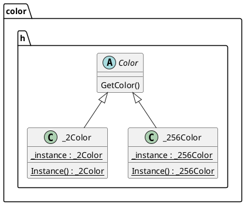
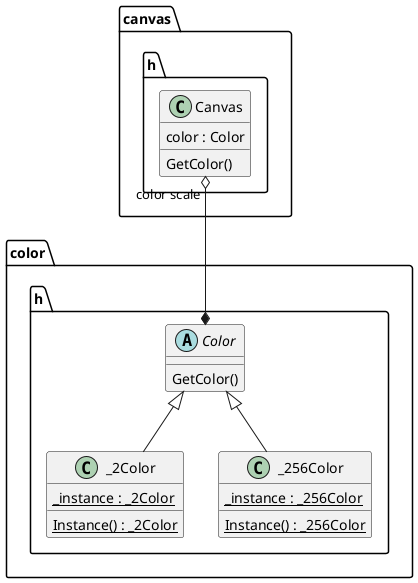
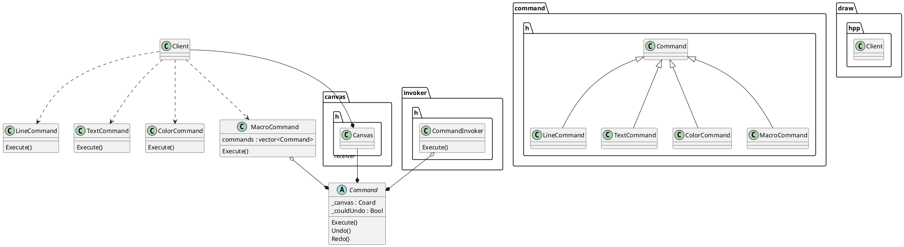
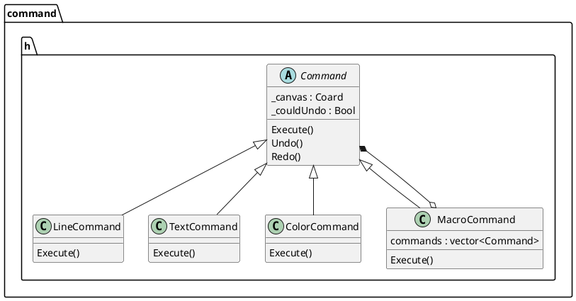

# 设计模式

本次 Lab 中采用了如下几种设计模式

### 单例模式

负责处理图像灰度级别的类 `Color` 采用单例模式，因为在程序的执行期间有且只应当有一个 `Color` 实例来负责全局灰度级别管理。

`Color` 类的 UML 图如下所示：

### 状态模式

在状态模式中，我们创建表示各种状态的对象和一个行为随着状态对象改变而改变的对象。我们采用状态模式设计画布类 `Canvas`，通过负责管理灰度级别的类 `Color` 来表示其恢复状态（黑白或者 256 灰度级别）：

### 命令模式

脚本中的不同指令采用命令模式进行设计，不同的指令被包裹在对象中，并传给调用对象 `invoker`。调用对象寻找可以处理该指令的合适的对象，并把该指令传给相应的对象执行:

### 组合模式

组合模式用于把一组相似的对象当作一个单一的对象。组合模式依据树形结构来组合对象，用来表示部分以及整体层次。这种模式创建了一个包含自己对象组的类。该类提供了修改相同对象组的方式。我们在设计指令类 `Command` 时采用了组合模式，其中宏指令类 `MacroCommand` 中包括一个指令类的列表：
